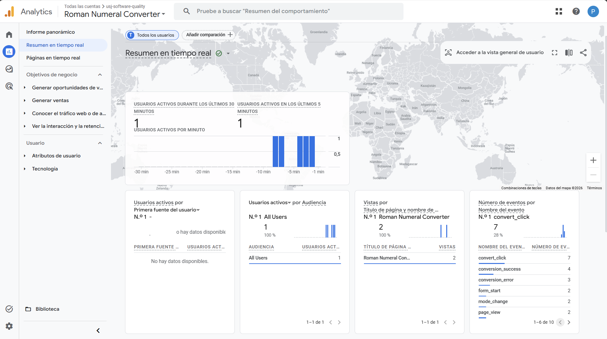
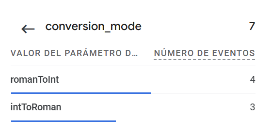
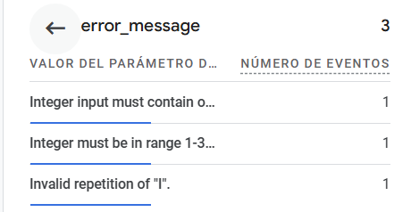

# Roman Numeral Converter - GA Report

> Note: This report was made by Juan Ramirez (alu.163243) and Pablo Villarte (alu.156336).

## Introduction

This report covers the Google Analytics 4 integration added to the [Roman Numeral Converter](https://pvillarte.github.io/juan.ramirez.alu163243.pablo.villarte.alu156336/). The source code is available in the [GitHub repository](https://github.com/pvillarte/juan.ramirez.alu163243.pablo.villarte.alu156336). Since our university mail does not support Google sign-in, the GA4 property was created using a personal Gmail account.

## Custom Events

We chose to track four events. The idea was not to track everything, but to pick the interactions that actually tell you something useful about how people use the converter.

- **`convert_click`:** fires every time the user presses Convert, with `conversion_mode` as a parameter (`intToRoman` or `romanToInt`). A pageview only tells you that someone opened the page. This event tells you they actually tried to use it, and in which direction.

- **`conversion_success`:** fires when a conversion completes without errors, with `conversion_mode` and the output `result` as parameters. Combined with `convert_click` and `conversion_error`, this lets you calculate a real success rate and spot usability problems over time.

- **`conversion_error`:** fires when the validator rejects the input, with `conversion_mode` and `error_message` as parameters. The error message is the exact text shown to the user, so you can see which validation rule causes the most trouble and decide if the interface needs to be clearer about it.

- **`mode_change`:** fires when the user switches the conversion direction. This tells you whether people come in knowing what they want or end up trying both directions. If `mode_change` happens a lot relative to `convert_click`, it probably means the tool is being used as a reference rather than for a quick one-off task.

## Results

The screenshot below shows the GA4 Realtime report after running some test conversions on the live site. All four custom events show up alongside the default ones, so the integration is working correctly.

*Figure 1. GA4 Realtime report showing the Roman Numeral Converter page and all four custom events.*

Looking at `convert_click` in detail, `romanToInt` was used 4 times and `intToRoman` 3 times during the session. It is a small sample, but it is exactly the kind of data this event is meant to capture.

*Figure 2. conversion_mode parameter inside convert_click, showing the split between both directions.*

The `error_message` parameter inside `conversion_error` shows three different errors: a non-digit input in integer mode, an integer outside the 1-3999 range, and an invalid Roman numeral repetition. Each one corresponds to a different validation rule, which means errors are not all coming from the same place.

*Figure 3. error_message parameter inside conversion_error, showing which validation rules were triggered.*

## Conclusions

The data from the test session is a small sample, but it already covers the questions that matter most: is the tool being used, does it work, and when it fails, why. Users tried both conversion directions, most conversions succeeded, and the errors that did occur were spread across different validation rules rather than concentrated in one. That last point is relevant: if most errors came from the same rule, it would be a clear signal that the interface is misleading users at a specific step. The fact that they are distributed suggests the converter behaves predictably and users are simply testing its limits.

From a quality perspective, having this instrumentation in place means that future changes to the interface or the validation logic can be evaluated against real usage data, not just test cases. If a UI change causes the error rate to go up, or shifts which errors are most common, the events will show it. That closes a feedback loop that automated tests alone cannot close, since tests verify that the code does what it is supposed to do, but analytics verify that users can actually use it.
